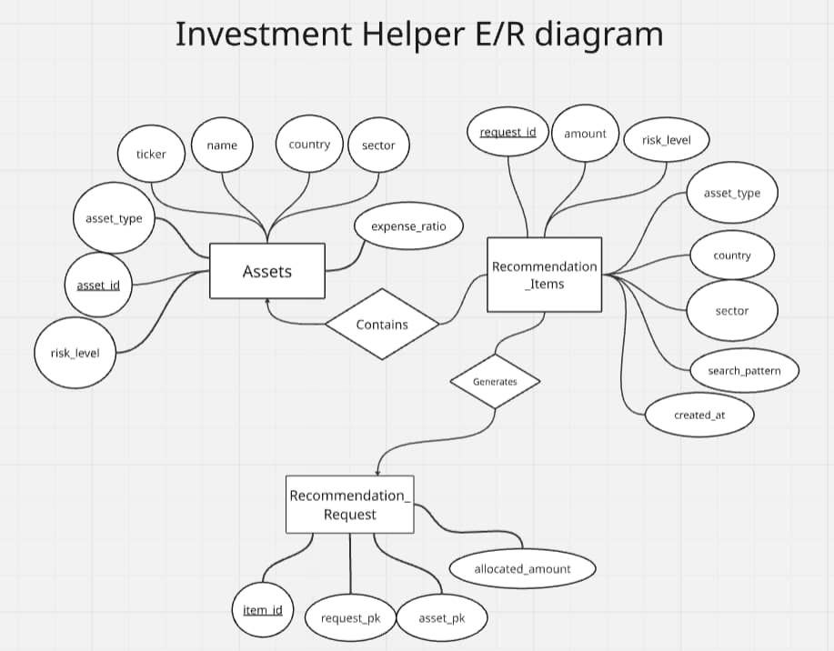

# E/R Diagram

## Description

The database has three main tables:

- `Assets` stores the available investment assets.
- `RecommendationRequests` stores each user request for an investment suggestion.
- `RecommendationItems` stores the generated allocation lines for each request.

Each recommendation request can generate many recommendation items. Each recommendation item points to one asset and one recommendation request.

The database also defines the SQL view `vw_assets`, which exposes the asset fields used by the filtering page.
